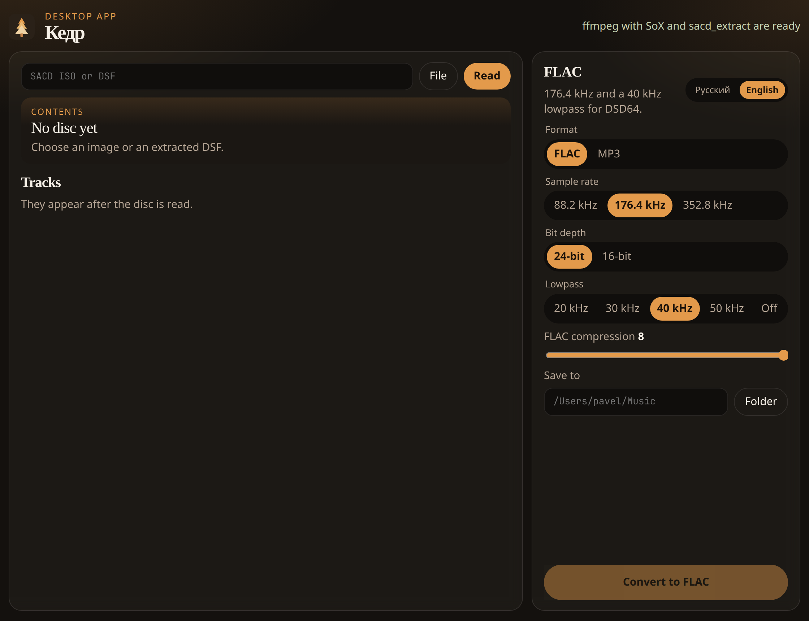

# Kedr

Desktop app that converts a Super Audio CD ISO (DSD) or a DSF file into PCM FLAC or MP3.



A Super Audio CD image stores one-bit DSD, often still packed as DST. FLAC and MP3 store PCM. Kedr reads the table of contents, decodes DST, and writes the format you pick, with tags taken from the disc. The window is Electron. Conversion stays on the machine and is done by Python.

## Requirements

- macOS 11 or newer, or Windows 10/11. On Linux the Electron window and `python3 -m kedr` work as well.
- On a Mac, [Homebrew](https://brew.sh). On Windows, winget, which is already part of the system.
- Python 3.9+, Node.js, ffmpeg, and `sacd_extract`.

`sacd_extract` is a separate program from [sacd-ripper](https://github.com/sacd-ripper/sacd-ripper) (GPL-2.0). A SACD image needs that tool. ffmpeg does not open it. Kedr itself is MIT. The installer downloads the extractor and builds it separately.

## Install on a Mac

From the folder that contains this file:

```bash
./scripts/install-macos.sh
open ~/Applications/Kedr.app
```

The script installs `cmake`, `pkgconf`, `libxml2`, `ffmpeg`, Python, and Node, builds `sacd_extract`, installs Electron, and puts a Kedr shortcut in `~/Applications`. Homebrew keeps `libxml2` away from the system headers, and the script passes that path itself. The window opens a local page. The album stays on the machine.

Run the script again after you change this folder. It refreshes the shortcut.

## Install on Windows

In PowerShell, from the folder that contains this file. MSYS2 goes into `C:\msys64`, which usually needs an administrator:

```powershell
powershell -ExecutionPolicy Bypass -File .\scripts\install-windows.ps1
```

The script uses winget to install MSYS2, Python, Node, and ffmpeg, builds `sacd_extract.exe` with UCRT64 (its DLLs sit next to the executable), installs Electron, and puts a Kedr shortcut on the desktop. That shortcut is `dist\Kedr.cmd`. It starts Electron from this folder. There is no signed installer. Build it on Windows.

Keep the project folder where it is after installation. The shortcut points at it.

## Without the installer

From the same folder:

```bash
npm install
npm start
```

The same page in a browser, without Electron:

```bash
python3 -m kedr serve --open
```

## How to use it

1. Choose a file, or paste a path to an `.iso` or `.dsf`.
2. Read. The artist, album, and tracks appear. If the disc has stereo and 5.1, pick the area.
3. Choose FLAC or MP3.
4. Choose a folder. Inside it, Kedr creates `Artist — Album`.
5. Convert to FLAC, or convert to MP3.

FLAC defaults: 176.4 kHz, 24-bit, 40 kHz lowpass, compression 8. The lowpass removes the ultrasonic noise of DSD. 352.8 kHz skips the extra downsampling, and the files are much larger.

MP3 defaults: LAME, 320 kbps, 44.1 kHz, 20 kHz lowpass. MPEG stores 44.1 or 48 kHz, and mono or stereo only. A multichannel area stays FLAC.

Temporary DSF files are deleted. If you stop a job, files already written stay.

## Command line

```bash
python3 -m kedr serve --open
python3 -m kedr info "/path/Album.iso"
python3 -m kedr convert "/path/Album.iso" -o ~/Music --mode stereo --rate 176400
python3 -m kedr convert "/path/Album.iso" -o ~/Music --format mp3 --bitrate 320
python3 -m kedr convert "/path/Album.iso" -o ~/Music --mode multi --tracks 1,2,4
python3 -m kedr tools
```

`--mode multi` selects the multichannel area, when the disc has one. MP3 refuses that area, because MP3 holds mono and stereo only.

`npm start` opens the desktop window. `python3 -m kedr` with no command opens the same page in a browser.

## Tests

```bash
python3 -m unittest discover -s tests
```

The tests convert a synthetic 440 Hz tone to FLAC and MP3. A full SACD ISO is not in the repository. Those files are someone else's recordings.

## Limits

- The result is PCM. Bit-perfect DSD stays a DSF file.
- Kedr reads a complete Super Audio CD image.
- MP3 is mono or stereo, at 44.1 or 48 kHz. 5.1 stays FLAC.
- Many players play only stereo FLAC.
- There is no signed bundle with Electron inside. On a Mac, `scripts/install-macos.sh` installs Electron into the project folder and launches it from the shortcut. On Windows, `scripts/install-windows.ps1` does the same.
